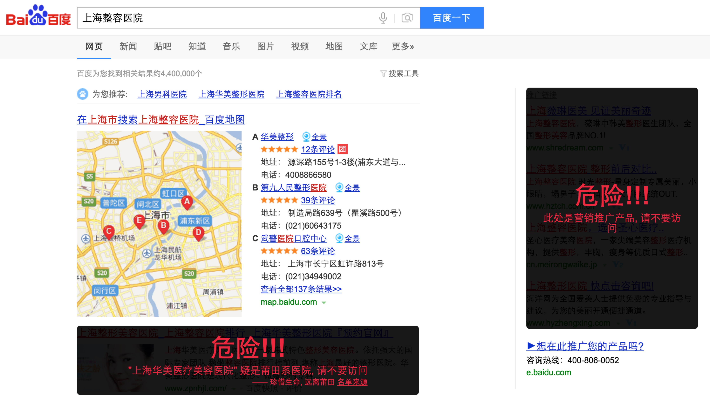
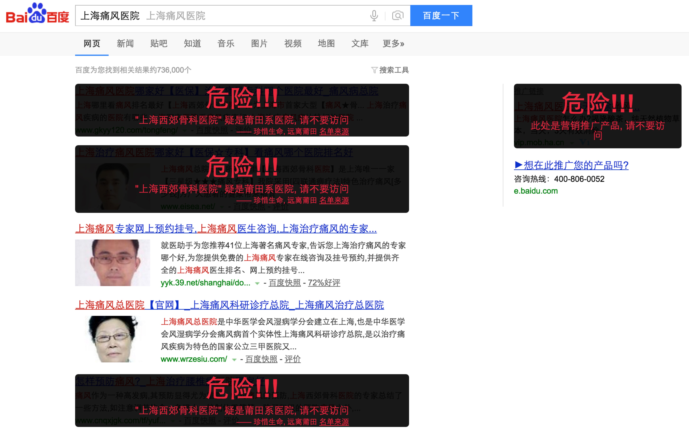
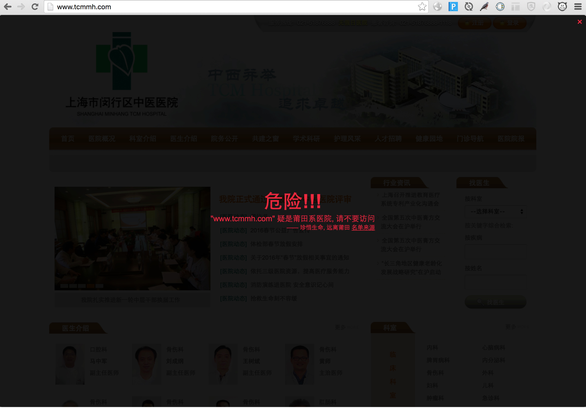

## 安装
如果打不开[安装地址](https://chrome.google.com/webstore/detail/%E9%A5%A5%E7%8C%AA%E9%98%85%E8%AF%BB/jfckifkogfenafeakigpkjlifbkklmih?hl=zh-CN), 可以使用本地安装的方式:

1. 下载安装包: [https://github.com/huntbao/piggyreader/blob/master/dist.zip](https://github.com/huntbao/piggyreader/blob/master/dist.zip) 并解压

2. 打开 Chrome 浏览器, 点击右上角的设置图标(有三条横杠), 选择 "更多工具" --> "扩展程序", 勾选"开发者模式", 选择"加载已解压的扩展程序..."

3. 选择第 1 步中解压的文件夹

刷新页面即可看到安装插件后的效果

## 说明

* 在使用百度搜索信息时, 如果出现"疑是莆田系医院", 会使用遮罩将其过滤, 以降低人们上当受骗的概率, 效果如图:

* 在访问"疑是莆田系医院"的网站时, 会使用全屏遮罩, 效果如图:

## [疑是莆田系医院的数据来源](https://github.com/open-power-workgroup/Hospital)
